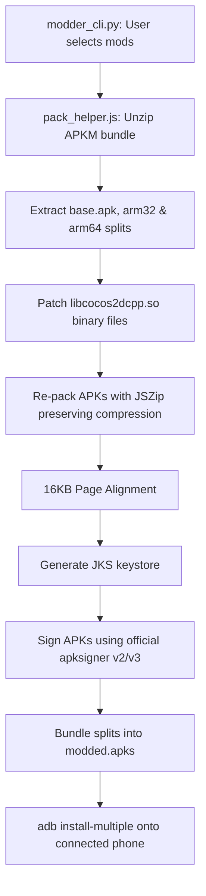

# Mini Militia Classic (0.14.4) Modding & Automation Engine

This repository provides an automated, customizable pipeline for reverse engineering, patching, page-aligning, signing, and installing modified versions of **Doodle Army 2: Mini Militia Classic (v0.14.4)**. It targets both **32-bit ARM (armeabi-v7a)** and **64-bit ARM (arm64-v8a)** architectures, ensuring compatibility with modern 64-bit-only devices and Android 16 (API 36) kernels.

---

## Table of Contents
1. [How the Mod Works (Binary Patching)](#how-the-mod-works-binary-patching)
2. [ARM Instruction Patching Details](#arm-instruction-patching-details)
3. [Supported Mods & Offsets](#supported-mods--offsets)
4. [How to Find More Mods](#how-to-find-more-mods)
5. [The CLI Automation Pipeline](#the-cli-automation-pipeline)
6. [Prerequisites & System Binaries](#prerequisites--system-binaries)
7. [Getting Started & Usage](#getting-started--usage)
8. [Git Workflow](#git-workflow)

---

## How the Mod Works (Binary Patching)

Android apps developed with Cocos2d-x compile their core gameplay logic in C++ rather than Java. This compiled logic is compiled into a stripped Shared Object (ELF) binary called `libcocos2dcpp.so`. 

When the game APK is loaded, the Android JNI interface loads this library. Since the binary is stripped, local debugging symbols are discarded, but **dynamic symbols** (exported classes, functions, and methods) must remain in the Dynamic Symbol Table (`.dynsym`) so that the JNI can link them.

By reading the virtual memory offset of these dynamic symbols, we can locate the exact starting byte of critical gameplay functions in the library file and overwrite their machine code instructions to alter the game's behavior.

---

## ARM Instruction Patching Details

Mini Militia Classic is compiled for two architectures. Modifying the game requires patching functions in both instruction sets:

### 1. 32-bit ARM (ARMv7-A)
*   **Default State**: Functions usually push registers onto the stack (`push {r11, lr}` -> `\x00\x48\x2d\xe9` in little-endian) and allocate frame space.
*   **Bypassing / Early Return**:
    *   To make a `void` function do nothing, we immediately return using `bx lr` (`\x1e\xff\x2f\xe1`).
    *   To force a boolean function to return `true` (1), we load `1` into the return register `r0` and return:
        ```arm
        mov r0, #1      ; \x01\x00\xa0\xe3
        bx lr           ; \x1e\xff\x2f\xe1
        ```
*   **Loading Floating-Point Numbers (e.g. 100.0f)**:
    In 32-bit ARM, floats are returned in `r0`. Since the immediate float `100.0` (IEEE 754: `0x42c80000`) is too large for a single instruction, we split it into lower/upper halves:
    ```arm
    movw r0, #0         ; \x00\x00\x00\xe3 (load lower 16-bits)
    movt r0, #0x42c8    ; \xc8\x02\x44\xe3 (load upper 16-bits)
    bx lr               ; \x1e\xff\x2f\xe1
    ```

### 2. 64-bit ARM (AArch64)
*   **Default State**: Functions allocate stack space (`sub sp, sp, #size` -> `\xff\x43\x00\xd1` in little-endian).
*   **Bypassing / Early Return**:
    *   To make a `void` function do nothing, we immediately return using `ret` (`\xc0\x03\x5f\xd6`).
    *   To force a boolean function to return `true` (1), we load `1` into the return register `w0` and return:
        ```arm
        mov w0, #1      ; \x20\x00\x80\x52
        ret             ; \xc0\x03\x5f\xd6
        ```
*   **Loading Floating-Point Numbers (e.g. 100.0f)**:
    In AArch64, floats are returned in `s0` (single-precision floating-point register). To return `100.0f`, we load the integer `100` into a general-purpose register and convert it to float:
    ```arm
    mov w0, #100    ; \x80\x0c\x80\x52
    scvtf s0, w0    ; \x00\x00\x22\x1e (Signed integer Convert to Floating-point)
    ret             ; \xc0\x03\x5f\xd6
    ```
    To return `0.0f`, we can write the floating-point zero register:
    ```arm
    fmov s0, wzr    ; \xe0\x03\x27\x1e
    ret             ; \xc0\x03\x5f\xd6
    ```

---

## Supported Mods & Offsets

Below is the technical specification of the patched offsets inside `libcocos2dcpp.so`. All offsets match the **v0.14.4** binary exactly.

| Mod Name | Function / Class | Architecture | File Offset | Original Bytes (LE) | Patch Bytes (LE) |
| :--- | :--- | :---: | :---: | :---: | :---: |
| **Unlimited Ammo** | `Weapon::subAmmo(int)` | 32-bit | `0x00812e38` | `00 48 2d e9` | `1e ff 2f e1` |
| | | 64-bit | `0x009482e0` | `ff 43 01 d1` | `c0 03 5f d6` |
| **Unlimited Flight** | `SoldierLocalController::hasPower()` | 32-bit | `0x007aa654` | `00 48 2d e9` | `01 00 a0 e3 1e ff 2f e1` |
| | | 64-bit | `0x008ec7b8` | `ff 83 00 d1` | `20 00 80 52 c0 03 5f d6` |
| **Unlimited Health** | `SoldierLocalController::getHP()` | 32-bit | `0x007ad9cc` | `04 d0 4d e2` | `00 00 00 e3 c8 02 44 e3 1e ff 2f e1` |
| | | 64-bit | `0x008ef1e4` | `ff 43 00 d1` | `80 0c 80 52 00 00 22 1e c0 03 5f d6` |
| | `SoldierController::getHP()` | 32-bit | `0x0079f1b8` | `04 d0 4d e2` | `00 00 00 e3 c8 02 44 e3 1e ff 2f e1` |
| | | 64-bit | `0x008e2b14` | `ff 43 00 d1` | `80 0c 80 52 00 00 22 1e c0 03 5f d6` |
| **Pro Pack Unlocked**| `InAppPurchaseBridge::isProductPurchased(...)` | 32-bit | `0x00878910` | `04 d0 4d e2` | `01 00 a0 e3 1e ff 2f e1` |
| | | 64-bit | `0x009a8f08` | `ff 43 00 d1` | `20 00 80 52 c0 03 5f d6` |
| **No Reload** | `Weapon::getReloadTime()` | 32-bit | `0x008131ec` | `00 48 2d e9` | `00 00 a0 e3 1e ff 2f e1` |
| | | 64-bit | `0x00948664` | `ff c3 00 d1` | `e0 03 27 1e c0 03 5f d6` |
| **Multishot (4x)** | `Weapon::getRoundsPerFire()` | 32-bit | `0x00813300` | `04 d0 4d e2` | `04 00 a0 e3 1e ff 2f e1` |
| | | 64-bit | `0x00948770` | `ff 43 00 d1` | `80 00 80 52 c0 03 5f d6` |
| **Dual Wield Any** | `Weapon::isDualWield()` | 32-bit | `0x008133c0` | `04 d0 4d e2` | `01 00 a0 e3 1e ff 2f e1` |
| | | 64-bit | `0x00948818` | `ff 43 00 d1` | `20 00 80 52 c0 03 5f d6` |
| | `Weapon::isDualWieldPrimaryOnly()` | 32-bit | `0x008133f8` | `04 d0 4d e2` | `01 00 a0 e3 1e ff 2f e1` |
| | | 64-bit | `0x00948858` | `ff 43 00 d1` | `20 00 80 52 c0 03 5f d6` |
| **Unlock Shop** | `ItemPurchase::isItemPurchased(...)` | 32-bit | `0x00513670` | `00 48 2d e9` | `01 00 a0 e3 1e ff 2f e1` |
| | | 64-bit | `0x00686c0c` | `ff 43 01 d1` | `20 00 80 52 c0 03 5f d6` |

---

## How to Find More Mods

To add your own mods, you must find function entry offsets and write the corresponding assembly instructions:

1.  **Extract the dynamic symbol table**:
    Use the `nm` tool to get the virtual offsets of exported JNI/C++ functions:
    ```bash
    nm -D libcocos2dcpp.so | grep -i "Soldier"
    ```
    This yields entries like:
    `008e2b14 T _ZN17SoldierController5getHPEv`
    Where `008e2b14` is the hexadecimal offset inside the binary file.

2.  **Verify the function signature & return type**:
    Inspect the demangled name. For instance, `_ZN6Weapon13getReloadTimeEv` demangles to `Weapon::getReloadTime()`. The `f` suffix in `setHP(float)` or instructions loading to `s0` show that the method returns a `float`.

3.  **Assemble custom patches**:
    Use the `llvm-mc` tool to compile assembly instructions into machine hex bytes:
    *   For **32-bit ARM**:
        ```bash
        echo "mov r0, #1; bx lr" | llvm-mc -triple=armv7-linux-gnueabihf -show-encoding
        ```
    *   For **64-bit ARM (AArch64)**:
        ```bash
        echo "mov w0, #1; ret" | llvm-mc -triple=aarch64-linux-gnu -show-encoding
        ```

---

## The CLI Automation Pipeline

When you run `./scripts/modder_cli.py`, it kicks off a Node-based backend script [pack_helper.js](scripts/pack_helper.js) that performs several essential reverse engineering operations:



### Critical Implementation Details:
*   **Blob/FileReader Polyfill**: `@chromeos/android-package-signer` expects a browser-like `Blob` and `FileReader` object. Since Node.js does not natively expose `FileReader`, a custom mock is injected at runtime using Node `Buffer` slices.
*   **Android 11+ Compressed Resource Constraints**: Android 11+ prevents installing packages where the `resources.arsc` file is compressed. The script checks `magic: '\x00\x00'` on zip files, ensuring `resources.arsc` is saved using the `STORED` (uncompressed) method.
*   **Android 16+ 16KB Page Alignment**: Uncompressed files (specifically `.so` libraries and `resources.arsc`) must be aligned on a page-size boundary inside the zip structure. On Android 16 (API 36) kernels, the boundary requirement is **16KB (16384 bytes)**. The package writer is patched to override standard 4-byte boundaries with `16384` byte alignments.
*   **APK Signature Scheme v2/v3**: Android 11+ prohibits installing packages with only v1 signatures. The script locates the developer's Flatpak Java installation and runs the official `apksigner` binary, injecting the v2/v3 signatures before installation.

---

## Prerequisites & System Binaries

The pipeline expects the following environment binaries to be present:
1.  **Node.js & npm** (used to run the packaging backend).
2.  **Python 3.x** (runs the interactive CLI wrapper).
3.  **Android Studio (Flatpak version)**: The script locates the bundled Java Runtime (`jbr/bin/java` & `keytool`) inside:
    `/home/zax4r0/.local/share/flatpak/app/com.google.AndroidStudio/...`
4.  **Android SDK Build-Tools**: The script uses `apksigner` located at:
    `/home/zax4r0/Android/Sdk/build-tools/37.0.0/apksigner`
5.  **ADB (Android Debug Bridge)**: Used to push the bundle onto the device.

---

## Getting Started & Usage

1.  **Install dependencies**:
    Ensure the Node modules are installed in the workspace directory:
    ```bash
    npm install @chromeos/android-package-signer jszip
    ```

2.  **Verify Device Connection**:
    Connect your phone via USB, enable **Developer Options** and **USB Debugging**. Run:
    ```bash
    adb devices
    ```
    *Ensure your phone displays `device` (not `unauthorized`). Grant permission on your phone screen if prompted.*

3.  **Launch the Modder CLI**:
    Execute the Python script to open the interactive selection menu:
    ```bash
    ./scripts/modder_cli.py
    ```

4.  **Choose Mods**:
    *   Toggle specific mods by entering their keyword (e.g. `ammo`, `flight`).
    *   Type `all` to toggle all mods.
    *   Press **Enter** (or type `done`) to build and automatically push the modded app to your phone!

---

## Git Workflow

The project uses a structured git development loop to track changes and stable scripts. 

*   Develop new mods or script adjustments in a dedicated feature branch:
    ```bash
    git checkout -b feature/interactive-mod-cli
    ```
*   Commit successful pipeline changes:
    ```bash
    git add scripts/pack_helper.js scripts/modder_cli.py
    git commit -m "feat: add interactive CLI and pack helper script"
    ```
*   Merge clean changes into the main branch:
    ```bash
    git checkout main
    git merge feature/interactive-mod-cli
    git branch -d feature/interactive-mod-cli
    ```